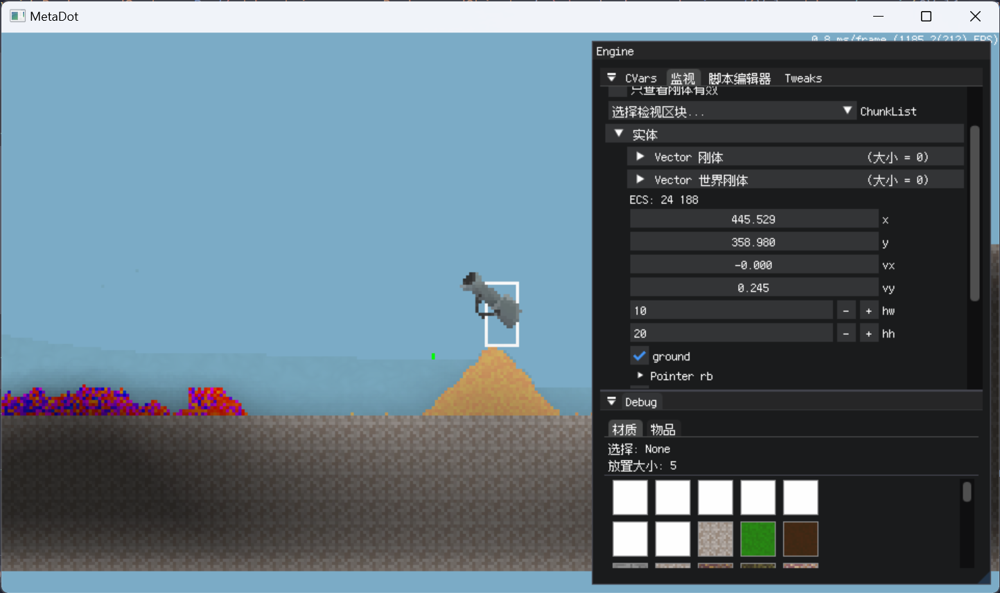

# FallingSand

A 2D falling-sand game framework (Windows/macOS/Linux)

(This project is based on part of the basic work of [PieKing1215's work](https://github.com/PieKing1215/FallingSandSurvival) which is under BSD 3-Clause License)



---

## **Compiling**

This project uses [*xmake*](https://xmake.io) as the build utility, it requires you to install xmake on your computer.

### Windows

```jsx
winget install xmake
```

### macOS

```jsx
brew install xmake
```

### ArchLinux

```jsx
sudo pacman -S xmake
```

### Dependencies

- SDL2 (core)
- GLAD
- SDL_GPU
- cJSON
- Box2D
- lua (lua core; kaguya binding; fbffi)
    - i18n cosmo inspect debugger lupeg tl
- lz4
- DearImgui
- FastNoise
- USRefl
- stb
- cute
- sse2neon (opt for *Apple Silicon*)

All compilation dependencies except SDL are already built into the repository source code. And SDL will automatically download and build through xmake. The only thing you need to do is to run the following command in the directory.

```jsx
xmake
```

After entering this command, all source codes will be automatically compiled and built, and the binary files will eventually be output in the output folder.

## Overview

This project adds many new functions and features on the basis of [PieKing1215's work](https://github.com/PieKing1215/FallingSandSurvival), including but not limited to:
- Complete base framework
- Scriptable Materials
- Lua-based dynamic script
- Cpp reflection of entities and rigid bodies
- New sound system
- New event system
- Reworked rendering system
- Better optimization
- Built-in UI system
- Inspection UI based on imgui
- New serialization and deserialization system (world saving)
- Refactoring based on ECS design ideas (WIP)
- NPC system (WIP)

It is worth noting that I'm a C++ newbie. Many codes in this project are not suitable for production. This project is for learning use only.

<video width="800" height="600" controls>
  <source type="video/mp4" src="screenshots/1.mp4">
</video>
<video width="800" height="600" controls>
  <source type="video/mp4" src="screenshots/2.mp4">
</video>

---

## Licensing

All original code from this project are licensed under the [MIT License](LICENSE).

All original code from [PieKing1215's work](https://github.com/PieKing1215/FallingSandSurvival) are licensed under the [BSD 3-Clause License](https://github.com/PieKing1215/FallingSandSurvival/blob/dev/LICENSE).